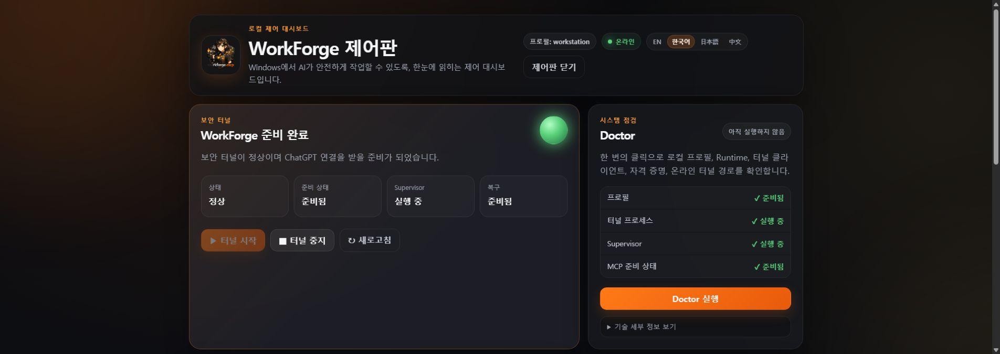

# WorkForge

**English** | [한국어](README.ko.md)

<p align="center">
  
</p>

> **ChatGPT is smart, but it does not normally have hands inside your PC. WorkForge gives it a safe pair of hands.**

WorkForge connects ChatGPT to your Windows or macOS workstation so it can inspect real project files, search and make guarded edits, read local images, and run supervised shell commands. If Git is installed, WorkForge can additionally inspect branches, commits, and change history.

macOS support is available in this fork as a source preview for Apple Silicon and Intel Macs. See [docs/MACOS.md](docs/MACOS.md). The existing Windows portable release remains unchanged.

In plain language, it is **a secure working bridge between ChatGPT and your computer**.

With WorkForge connected, you can say things like:

```text
"Read this project and tell me where I left off."
"Find out why this build is failing and fix it."
"Update the README so it matches the current code."
"Check Git and summarize my recent work."
"Run the tests and investigate anything that fails."
```

Instead of only explaining what you should do, ChatGPT can **look at the actual workspace and work through the task with you**.

---

## Why does WorkForge exist?

Normally, ChatGPT cannot see the files on your computer.

If a project has a bug, the usual workflow looks something like this:

```text
1. Copy the error message
2. Paste it into ChatGPT
3. Find the related source file
4. Copy that code too
5. Ask for a fix
6. Paste the fix back into the file
7. Run the build yourself
8. Copy the next error
9. Repeat
```

WorkForge changes that loop to:

```text
You
  ↓
"Check the project, find the problem, and fix it."
  ↓
ChatGPT
  ↓
WorkForge
  ↓
Your real files · search · optional Git context · PowerShell
```

ChatGPT can inspect the information it needs, understand the current state, make allowed changes, and verify the result.

That means moving from **describing your workspace to AI through copy and paste** to **letting AI inspect the workspace and collaborate inside it**.

---

## What gets better?

### 1. You spend less time explaining the project

You no longer need to repeatedly describe the folder structure, paste file contents, and report Git state by hand.

```text
Before
"There is a file under Assets/Scripts..."
"Here is the code..."
"I changed this yesterday..."

With WorkForge
"Read the project."
```

### 2. ChatGPT can answer from the current state

It can inspect the real files and Git status instead of relying only on old conversation context.

Questions like these become much more useful:

```text
"What was I working on recently?"
"How far is this feature implemented?"
"Why is the build broken right now?"
"Change this file and run the tests afterward."
```

### 3. It can move from inspection to verification

WorkForge can do more than read files. It can also run supervised PowerShell jobs.

That enables a practical loop such as:

```text
Inspect code
  ↓
Edit file
  ↓
Run build
  ↓
Read errors
  ↓
Fix again
```

### 4. It does not blindly overwrite files

Guarded edits use the current SHA-256 of a file.

A simple way to think about it is:

> "Only change the file if it is still the same file I just inspected. If somebody changed it first, stop."

This helps prevent stale edits from overwriting newer work.

### 5. Shell work is supervised

PowerShell jobs have separate start, status, output, and cancel operations.

If the ChatGPT connection disappears, WorkForge does not secretly replay an old command later.

---

## What can it do?

WorkForge currently exposes 12 MCP tools, but you do not need to memorize their names. From a user's point of view, they fit into five simple groups.

### 📁 Look through files and folders

```text
"Show me the structure of this project."
"Find files related to inventory."
"Read this configuration file."
```

### ✏️ Create and edit files

```text
"Add the new installation steps to the README."
"Refactor this name safely."
"Create a new configuration file."
```

### 🧭 Understand project state

```text
"Read this project and tell me what I was doing."
"What has changed in Git?"
"What changed since the last commit?"
```

### 🖥️ Run PowerShell work

```text
"Run the build."
"Run the test suite."
"Check the status of this process."
```

### 🖼️ Inspect local images

```text
"Open this PNG and describe the UI."
"Check this image's size and contents."
```

---

## What can I use it for?

WorkForge is not tied to one IDE or one game engine. If a Windows project is made of files and command-line workflows, WorkForge can often help with it.

### Software and game projects

Examples include:

```text
Unity
Godot
Node.js
Python
Web projects
CLI tools
Open-source repositories
```

ChatGPT can inspect the project, understand its current state, make changes, and run validation steps.

### Does my project have to be a Git repository?

**No.** WorkForge's default mode is an ordinary local folder.

```text
C:\Projects\MyGame
C:\Work\Prototype
C:\Documents\Notes
```

A folder does not need a `.git` directory for WorkForge to read, search, edit, inspect images, or run PowerShell commands inside it.

Git is an **optional enhancement**.

```text
Without Git
→ Local Folder Mode
→ read / search / edit / images / PowerShell

With Git
→ Git Enhanced Mode
→ everything above + branches / recent commits / changed files /
  staged·unstaged state / ahead·behind information
```

So **WorkForge can install, load its profile, and work with the current folder without Git, while Git lets it understand more of the project's history.** WorkForge does not automatically turn its own operating workspace into a Git repository; existing Git metadata from older installs is simply preserved.

### Returning to an old project

After a few weeks away, you can say:

```text
"Read this project and its recent Git history, then tell me where I left off."
```

`project_resume(path)` can target that project directly and returns its current branch, changed files, and recent commits without making the WorkForge operating folder the project.

### Debugging

```text
"Run the build. If it fails, find the related files and investigate the cause."
```

This reduces the amount of error logs and source code you have to shuttle back and forth manually.

### Documentation

```text
"Rewrite the README so it matches the current implementation."
"Check whether the installation scripts and docs still agree."
```

Because ChatGPT can inspect both code and documentation, it can help catch stale instructions.

### Repetitive local workflows

```text
"Check these files for anything that violates this rule."
"Run the tests and summarize only the failures."
```

WorkForge is not a general remote-desktop robot. It focuses on files, Git, images, and PowerShell under the current Windows account and WorkForge's safety rules.

---

## Is it difficult to install?

A normal installation takes **three steps**.

```text
1. Download the ZIP
2. Extract it and run Setup.cmd
3. Connect the same Tunnel in ChatGPT
```

You do not need to manually hunt down Node.js and ripgrep first. Git can be added optionally during Setup if you want project-history features.

### Ask Codex to prepare the installer

You can give Codex this repository URL and ask it to install WorkForge. Use this
copy-ready request:

```text
Install WorkForge from https://github.com/NotNull92/workforge-mcp on this Windows PC.
Use the latest published GitHub Release asset named WorkForge-v*-win-x64.zip and its matching .sha256 file.
Do not clone or build main. Verify the checksum, extract the ZIP to a new local folder, and give me the exact Setup.cmd path.
If you can launch an interactive Windows installer, start Setup.cmd and let me enter the Tunnel ID and Runtime API Key directly in Setup.
Do not request, read, store, print, or pass those values through chat or command-line arguments.
Do not enable Windows startup. If the required Release assets do not exist, stop and tell me instead of installing from source.
```

The safe agent installation contract is:

- Prefer the latest published [GitHub Release](https://github.com/NotNull92/workforge-mcp/releases/latest), never a source checkout, branch archive, `npm install`, or local build.
- Require both `WorkForge-v*-win-x64.zip` and its matching `.sha256` file, and verify the archive before extraction.
- Extract into a new local folder. If Codex cannot launch an interactive Windows process, it must stop at the exact `Setup.cmd` path for the user.
- Enter the Tunnel ID and Runtime API Key only in Setup. Do not paste either value into the Codex conversation.
- Let `Setup.cmd` select Install, Repair, or Upgrade. Do not delete an existing WorkForge installation just to reinstall it.
- Keep Windows startup disabled. ChatGPT plugin creation and workspace authorization remain manual user actions.
- If no complete published Release exists, stop. A source checkout is a developer workflow, not a supported end-user installation fallback.

Codex may request approval for the GitHub download or for writing outside its
current workspace. Approve only the exact Release assets and destination you
expect. OpenAI documents these network and filesystem approval boundaries in
[Agent approvals & security](https://learn.chatgpt.com/docs/agent-approvals-security).

### 1. Download and extract

Download the latest release archive:

```text
WorkForge-v*-win-x64.zip
```

Extract it to any local folder. `Setup.cmd` verifies the package and stages the
active version under `%LOCALAPPDATA%\Programs\WorkForge`.

### 2. Run Setup

Double-click:

```text
Setup.cmd
```

The release ZIP already includes and verifies:

```text
Bundled
✓ Node.js 24 x64    WorkForge runtime
✓ ripgrep           fast file and text search
✓ tunnel-client     explicit ChatGPT Secure MCP Tunnel path

Optional
○ Git for Windows   Git Enhanced Mode for branches, commits, and change history
```

The rule is simple:

```text
Git missing                           → continue without Git or install it optionally
Existing WorkForge version            → stage side-by-side, validate, rebind tunnels, then switch current.json
```

So **compatible software is not reinstalled, and missing Git does not block Setup**.

### Updating from v0.1.0

The already-published v0.1.0 build does not contain the updater UI, so it needs one manual bridge into the v0.2.x line. Use **v0.2.1 or a newer stable Windows Release ZIP**, extract it to a new folder, and run its `Setup.cmd`. Do **not** uninstall v0.1.0 first. The original v0.2.0 ZIP has a post-upgrade Setup parameter-forwarding bug and should not be used for a new v0.1.0 bridge attempt.

That Setup path performs a transactional side-by-side upgrade. It fully hashes the new engine before activation, preserves the old engine as the rollback target, stops only tunnels that were running, rebuilds existing tunnel profiles against the new Node/stdio paths without rewriting the protected credential, validates them, and restarts the tunnels that were running before the update. If validation fails, `current.json` and the original tunnel configuration are restored and the previous engine is reactivated.

Starting with v0.2.0, normal future updates can be performed from **WorkForge Control → Update WorkForge** instead of downloading the ZIP manually. If v0.2.0 is already active after the known Setup error, no reinstall or rollback is required; update normally to v0.2.1 or newer.

Portable releases do not use WinGet for Node.js or ripgrep. The source-checkout
developer path retains the existing consent-gated prerequisite bootstrap. Git
installation is always separate and optional; the default remains **Continue
without Git**.

The release ZIP contains the compiled MCP server, production npm dependencies,
and pinned Windows runtimes. Regular release users do not run npm, TypeScript,
Vitest, or the repository test suite.

### 3. Finish the ChatGPT connection

During Setup, you need an OpenAI Platform Tunnel ID and Runtime API Key that you are authorized to use.

Setup opens the ChatGPT Plugins page after the tunnel is configured. Complete
the following manual authorization steps while the WorkForge tunnel is running:

These steps follow OpenAI's current
[plugin connection guide](https://developers.openai.com/plugins/deploy/connect-chatgpt).

1. Open **Settings > Security and login** and enable **Developer mode**.
2. On the Plugins page, select **+** beside **Plugin search**.
3. Optionally choose an icon, then enter **WorkForge** as the name.
4. Under **Connection**, select **Tunnel** and choose the tunnel created for WorkForge.
5. Set **Authentication** to **None**.
6. Select the acknowledgement checkbox at the bottom and choose **Create**.
7. Confirm that **WorkForge** appears under **Installed**.

To verify the connection:

1. Start a new conversation in **Chat**, not **Work**.
2. Type `@WorkForge` and select the plugin, or select WorkForge from the tools menu.
3. Enter a full local project path and ask WorkForge to review the project, for example:

```text
C:\Projects\MyGame Review this project and summarize its current state.
```

Keep the tunnel running for plugin discovery and every WorkForge call. After a
Windows restart, start it manually from **WorkForge Control**; Setup does not
register WorkForge to start with Windows.

---

## How do I use it after installation?

You do not need a special command language.

Talk to ChatGPT normally.

For example:

```text
"Check C:\Projects\MyGame and tell me its current state."
```

```text
"Build this project and investigate any errors."
```

```text
"Look at the recent work and update the README."
```

```text
"Inspect this file first, then change it safely."
```

ChatGPT chooses the WorkForge tools it needs.

---

## Day to day, just open WorkForge Control

After setup, you do not need to run `Setup.cmd` again for normal use. Prefer the installed **WorkForge Control** shortcut or `%LOCALAPPDATA%\Programs\WorkForge\WorkForge Control.cmd`; release-root lifecycle wrappers delegate to that active installed engine instead of acting as a second runtime.

Double-click:

```text
WorkForge Control.cmd
```

Instead of a console menu, WorkForge now opens a **local browser dashboard** where you can see the important state at a glance and manage it with buttons. This `WorkForge Control.cmd` section and its automatic-update flow apply to the Windows portable release. The macOS source preview also has a `WorkForge Control.command` dashboard for start, stop, status, online Doctor, and profile unregistration, but it does not provide automatic updates or **Remove Everything**.



*The dashboard shown in Korean. Use the language selector at the upper right to switch to English, Korean, Japanese, or Chinese.*

```text
Secure Tunnel   Online / Offline
Health          Healthy / Attention
Readiness       Ready / Waiting
Supervisor      Running / Stopped
Recovery        Normal / Recovering
```

From the Dashboard you can:

- **Start Tunnel** so ChatGPT can reach WorkForge.
- **Stop Tunnel** and its supervisor safely.
- **Refresh** the current state immediately.
- **Run Doctor** to check the profile, runtime, tunnel client, credential and online path.
- **Update WorkForge** to check the canonical stable GitHub Release and install it transactionally after ZIP/checksum and engine-integrity verification.
- Review **Recent Activity** in short human-readable messages.
- Open **Uninstall**, preview the removal with `WhatIf`, and confirm before anything is deleted.

The Dashboard starts in your browser language when it can, and remembers the language you choose. During an update, keep the Control window open: its progress display shows the safety path from checking and downloading through verification, staging, tunnel pause/rebind, Doctor, restart, and finish. If a validation step fails, WorkForge restores the previous engine instead of leaving a mixed installation behind. After a successful update, it retires the old Control Server so the old Dashboard cannot keep checking status against the newly activated engine. Close the update tab and open **WorkForge Control** again to load the active version's Dashboard.

The Dashboard is not a remotely exposed admin site. It binds only to **`127.0.0.1` on the current PC**, uses a fresh local session each time, rejects cross-origin control requests, and shuts its background Control Server down after the browser stops making requests for a while.

The old terminal control path is still available as a recovery and advanced-user fallback:

```text
WorkForge Control.cmd --cli
```

Advanced users can also invoke `scripts\Control.ps1` actions such as `start`, `stop`, `status`, and `doctor` directly.

---

## Is it safe?

WorkForge gives ChatGPT meaningful access to a workstation, so safety is part of the design rather than an afterthought.

### It stays inside the current Windows user's permissions

WorkForge runs as the Windows account that launched it.

It is not a privilege-escalation tool and does not bypass Windows ACLs or UAC.

### It does not install startup persistence

By default, WorkForge does not create:

```text
Windows services
Scheduled tasks
Startup items
Run registry entries
```

After a reboot, the Tunnel stays stopped until the user starts it again.

### It does not replay commands after a disconnect

An interrupted connection does not authorize WorkForge to replay an old PowerShell command later.

### File edits are guarded against stale state

SHA-256 checks help prevent a file that changed in the meantime from being overwritten using an older version.

### Runtime credentials are kept away from ordinary project commands

The Runtime API Key is stored in a protected local file and removed from the environment before project or shell code is launched.

ForgeUI logs also redact user-home paths, complete Tunnel IDs, and common credential-shaped values.

---

## ForgeUI

WorkForge does not dump an unreadable wall of PowerShell output during setup and maintenance.

Its terminal UI shows the lifecycle as clear stages:

```text
✓ Environment
✓ Prerequisites
✓ Runtime and profile
◆ Secure tunnel
○ Health check
○ ChatGPT handoff
```

Successes, warnings, failures, and next steps are easier to spot.

ForgeUI is implemented in PowerShell and does not require `gum.exe` or a Go runtime.

For CI, redirected output, `NO_COLOR`, `WORKFORGE_PLAIN_UI=1`, or `-Plain`, it automatically falls back to deterministic plain text.

---

## What if WorkForge is already installed?

Run `Setup.cmd` again.

WorkForge decides automatically:

```text
No existing profile   → Install
Existing profile      → Repair
```

Repair preserves user-edited policy files, Tunnel configuration, credentials, and related local state instead of blindly replacing them.

Upgrade also avoids overwriting user instructions. If a distributed template changed, WorkForge can place a `<file>.new` candidate next to the user's file for comparison.

---

## Uninstalling WorkForge

Double-click:

```text
Uninstall.cmd
```

You get two choices.

### KeepWorkspace recommended

Remove WorkForge's operational connection and runtime state while keeping your workspace.

```text
Kept
- WorkForge workspace
- Git history
- user-edited policy files
- user-created files

Removed
- Tunnel configuration
- local Runtime credential
- WorkForge runtime state and logs
- profile registry connection
- verified release engine when safe
```

### RemoveEverything

Remove the workspace too.

Interactive mode requires the exact phrase:

```text
REMOVE WORKFORGE
```

WorkForge never automatically deletes a development source checkout.

See [Uninstall WorkForge](docs/UNINSTALL.md) for details.

---

## What WorkForge is not

WorkForge is not:

- a remote-desktop bot that clicks anything on Windows
- a tool that secretly acquires administrator privileges
- an always-on background service
- an automation engine that blindly approves every command
- a plugin tied only to Unity or one specific IDE

Its job is narrower and more deliberate: **provide a clear, verifiable working path between ChatGPT and a local Windows workspace.**

---

## Technical details

Everything below is for people who want to understand or develop WorkForge itself.

### The 12 MCP tools

```text
workstation_context
project_resume
list_directory
search_files
read_text_file
read_image
write_text_file
replace_text
shell_start
shell_status
shell_output
shell_cancel
```

### Default profile

The default operating profile is created at:

```text
%USERPROFILE%\WorkForge
```

It contains durable instructions and local profile information used while WorkForge operates.

### Runtime behavior

- no Windows startup persistence is created
- Tunnel start is explicit
- unexpected Tunnel exits use bounded same-profile recovery
- disconnected commands are never replayed automatically
- PowerShell descendants are managed with Windows Job Objects
- same-profile shell work is serialized to avoid collisions
- direct file tools enforce registered-profile path boundaries; PowerShell validates its working directory but is not an OS sandbox and retains the current Windows user's ACL/UAC access

### Diagnostics

```powershell
powershell.exe -NoProfile -ExecutionPolicy Bypass -File scripts\Doctor.ps1 -Online
powershell.exe -NoProfile -ExecutionPolicy Bypass -File scripts\Control.ps1 -Action status
```

See [Troubleshooting](docs/TROUBLESHOOTING.md) when something goes wrong.

### Source development

```powershell
npm.cmd ci
npm.cmd run check
npm.cmd run smoke:stdio -- workstation
npm.cmd run release
```

`npm run check` validates the TypeScript server plus no-Git installation, multi-profile loading, prerequisite detection, installation modes, the loopback-only Control Dashboard, CLI fallback, ForgeUI, Uninstall, historical Git privacy scanning, security, Tunnel recovery, and production dependencies.

### Privacy gate

The public repository is scanned to prevent accidental publication of sensitive local data. The gate checks current tracked and untracked files plus **reachable historical text blobs**, so deleting a sensitive value from the latest commit does not make an older copy invisible.

Examples include:

```text
personal user-home paths
non-example email addresses
real Tunnel IDs
credential-shaped values
phone numbers
private network information
runtime logs
registry and credential files
```

The same privacy check runs in GitHub Actions on pushes and pull requests.

---

## Learn more

- [Security](SECURITY.md)
- [Troubleshooting](docs/TROUBLESHOOTING.md)
- [Uninstall](docs/UNINSTALL.md)
- [Architecture](docs/ARCHITECTURE.md)
- [Adding profiles](docs/ADDING_PROFILES.md)

## License

WorkForge is released under the [MIT License](LICENSE).
